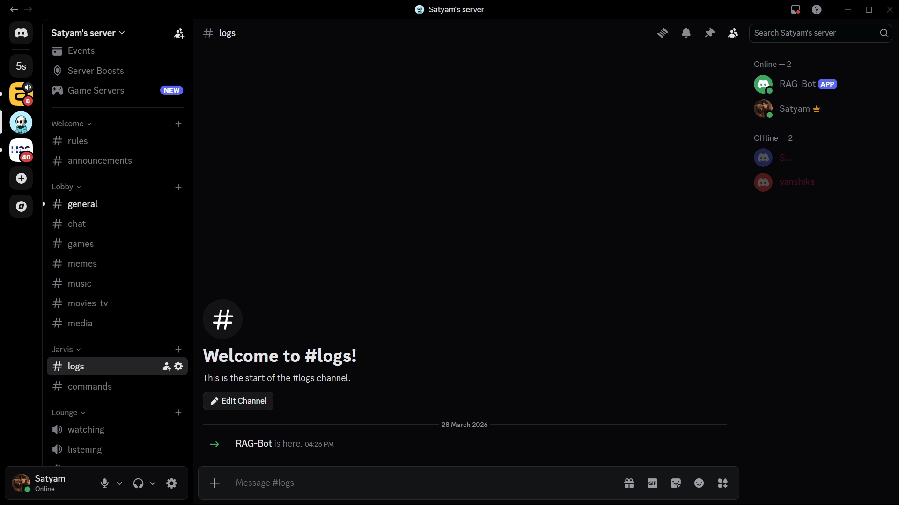
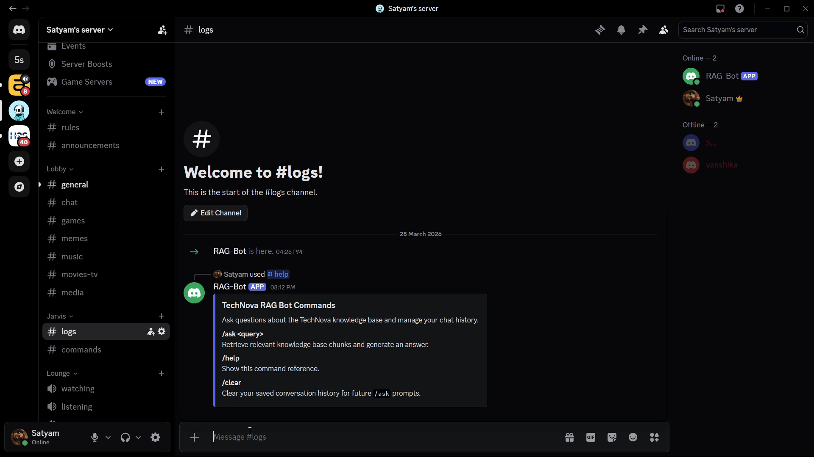
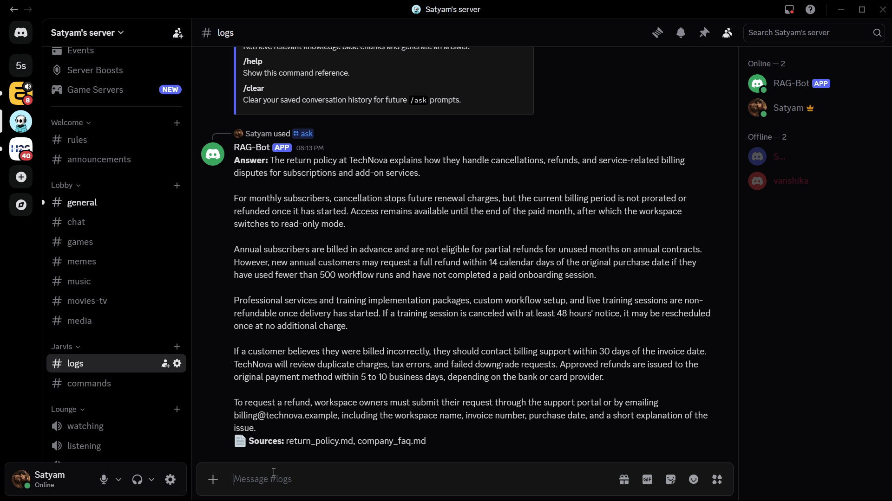
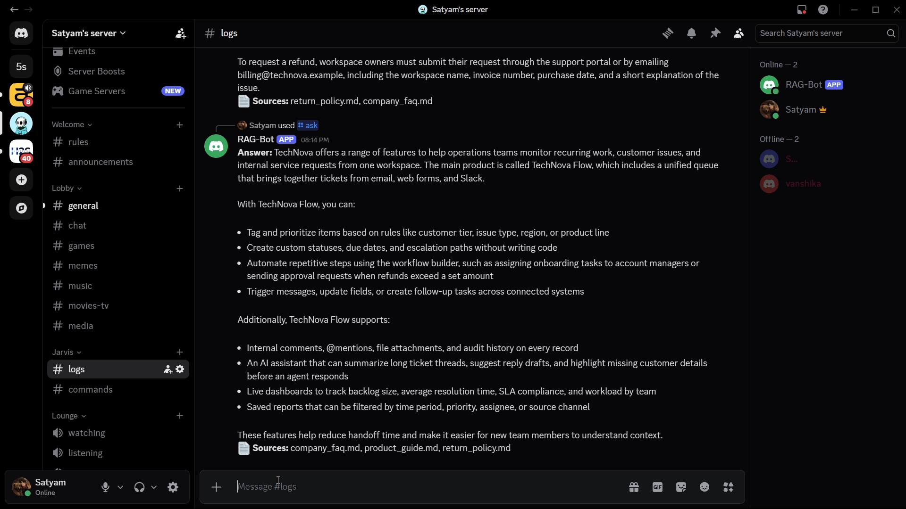

# Discord RAG Bot

A local-first Discord support bot that answers slash-command questions from your own knowledge base using retrieval-augmented generation (RAG). It stores embeddings in `sqlite-vec`, generates answers through Ollama, and returns both an answer and the source documents used.

## Demo

### `/help`



### `/ask` example 1



### `/ask` example 2



### `/clear`



## Overview

This project is designed for simple, local RAG workflows:

- Discord users ask questions with `/ask`.
- The bot embeds the question with `all-MiniLM-L6-v2`.
- The retriever finds the closest chunks from a local `sqlite-vec` database.
- The prompt builder combines retrieved context and recent chat history.
- Ollama runs `llama3.2` locally and returns the final answer.
- The bot replies in Discord with the answer and source filenames.

The code is split into small modules so it is easy to understand and extend:

- `app.py`: simple run entrypoint
- `main.py`: bot startup, command sync, startup checks
- `config.py`: environment loading and validation
- `bot/commands.py`: slash commands for `/ask`, `/help`, and `/clear`
- `bot/history.py`: in-memory conversation history per user
- `rag/embedder.py`: lazy singleton embedder
- `rag/ingester.py`: document loading, chunking, embedding, and DB creation
- `rag/retriever.py`: vector search and top-k retrieval
- `rag/llm.py`: prompt building and Ollama chat calls

## Models And APIs Used

### Models

- Embedding model: `sentence-transformers/all-MiniLM-L6-v2`
- Generation model: `llama3.2` served by Ollama

### APIs And Services

- Discord API through `discord.py` for slash commands
- Ollama local HTTP API through the `ollama` Python client
- `sqlite-vec` for local vector similarity search inside SQLite

No OpenAI API key is required for this project. Everything runs locally except Discord itself.

## System Design

```text
Discord User
    |
    v
Discord Bot (/ask)
    |
    v
Retriever
    |
    v
SQLite-vec DB
    |
    v
LLM (Ollama / llama3.2)
    |
    v
Discord Reply
```

Expanded request flow:

```text
Discord User
  -> /ask query
  -> Bot command handler
  -> Embed query with all-MiniLM-L6-v2
  -> Retrieve top chunks from sqlite-vec
  -> Build prompt with chunks + recent history
  -> Send prompt to Ollama
  -> Return answer + sources
  -> Discord Reply
```

## Share This Project With A Friend

You can share the project in either of these ways:

### Option 1: Git repository

1. Push the project to GitHub, GitLab, or another Git host.
2. Share the repository URL.
3. Your friend can run:

```bash
git clone <your-repo-url>
cd DiscordBot
```

### Option 2: Zip the project folder

1. Compress the whole project directory.
2. Share the zip file.
3. Your friend extracts it and follows the same local or Docker steps below.

If you share the repo, do not include your real `.env` file or Discord token.

## Prerequisites

Choose one run method:

- Local Python run:
  - Python 3.11+
  - Ollama installed locally
  - A Discord bot token
- Docker Compose run:
  - Docker Desktop or Docker Engine with Compose
  - A Discord bot token

## Environment Setup

1. Copy the example env file:

Windows PowerShell:

```powershell
Copy-Item .env.example .env
```

macOS / Linux:

```bash
cp .env.example .env
```

2. Edit `.env` and set your bot token:

```env
DISCORD_TOKEN=your_real_discord_bot_token
OLLAMA_MODEL=llama3.2
```

3. Set `OLLAMA_HOST` based on how you plan to run the app:

- Local Python run:

```env
OLLAMA_HOST=http://localhost:11434
```

- Docker Compose run:

```env
OLLAMA_HOST=http://ollama:11434
```

## Run Locally With Python

### 1. Clone the project

```bash
git clone <your-repo-url>
cd DiscordBot
```

### 2. Create and activate a virtual environment

Windows PowerShell:

```powershell
python -m venv .venv
.venv\Scripts\Activate.ps1
```

macOS / Linux:

```bash
python -m venv .venv
source .venv/bin/activate
```

### 3. Install dependencies

```bash
pip install -r requirements.txt
```

### 4. Start Ollama locally

```bash
ollama pull llama3.2
ollama serve
```

Make sure your `.env` uses:

```env
OLLAMA_HOST=http://localhost:11434
```

### 5. Add or review knowledge base files

Place `.md` or `.txt` files in `knowledge_base/`. Sample files are already included.

### 6. Build the vector database

```bash
python rag/ingester.py
```

If you update documents later and want a fresh rebuild:

```bash
python rag/ingester.py --force
```

### 7. Start the bot

```bash
python app.py
```

The bot will connect to Discord, sync slash commands, and auto-ingest on startup if `data/vectors.db` does not exist yet.

## Run With Docker Compose

### 1. Clone the project

```bash
git clone <your-repo-url>
cd DiscordBot
```

### 2. Create `.env`

Copy `.env.example` to `.env` and set:

```env
DISCORD_TOKEN=your_real_discord_bot_token
OLLAMA_MODEL=llama3.2
OLLAMA_HOST=http://ollama:11434
```

### 3. Start the full stack

```bash
docker compose up --build
```

This Compose setup starts:

- `ollama`: the local model server
- `model-puller`: pulls `llama3.2`
- `discord-bot`: waits for Ollama, ingests the knowledge base, and starts the bot

### 4. Stop the stack

```bash
docker compose down
```

To rebuild the vector database after changing documents, you can remove `data/vectors.db` or run a force ingest inside the bot container.

## Adding Your Own Knowledge Base Documents

Add `.md` or `.txt` files to `knowledge_base/`. Good documents for this project usually have:

- clear headings
- short paragraphs
- explicit factual statements
- one main topic per file

Example structure:

```text
knowledge_base/
├── company_faq.md
├── product_guide.md
├── return_policy.md
├── onboarding.md
└── security.txt
```

After editing the knowledge base, rebuild embeddings:

```bash
python rag/ingester.py --force
```

## Bot Commands

### `/help`

Shows an embed listing the available commands.

Example:

```text
/help
```

### `/ask <query>`

Retrieves relevant chunks from the knowledge base and generates an answer with sources.

Examples:

```text
/ask What is TechNova's return policy?
/ask Does TechNova support single sign-on?
/ask What are the main features of the product?
```

Typical reply format:

```text
Answer: <generated answer text>
Sources: company_faq.md, product_guide.md
```

### `/clear`

Clears the last stored conversation turns for the current user.

Example:

```text
/clear
```

## Notebook Prototypes

The `tests/notebooks/` folder contains exploratory notebooks that show the progression from early experiments to the final modular implementation:

- `01_chunking_prototype.ipynb`
- `02_ingestion_prototype.ipynb`
- `03_retrieval_prototype.ipynb`
- `04_prompt_and_answer_prototype.ipynb`

## Why These Model Choices

### Why `all-MiniLM-L6-v2`?

- fast enough for local development
- strong semantic search quality for short FAQ and support content
- lightweight compared with larger embedding models
- practical for rebuilding a local vector database quickly

### Why Ollama and `llama3.2`?

- runs locally with no cloud API key
- easy to switch models through `.env`
- works well for demos, prototypes, and private local knowledge bases
- integrates cleanly with Docker and local development workflows

## Troubleshooting

### `DISCORD_TOKEN is missing`

Add a real token to `.env`:

```env
DISCORD_TOKEN=your_real_discord_bot_token
```

### `Knowledge base not initialized. Run ingester.py first.`

Run:

```bash
python rag/ingester.py
```

### `Ollama is not running. Start it with: ollama serve`

For local runs, start Ollama:

```bash
ollama serve
```

For Docker runs, check:

```bash
docker compose ps
docker compose logs ollama
```

### Slash commands are not showing up

- confirm the bot is invited to your server with `applications.commands` scope
- wait a moment after startup for command sync
- check the bot logs for sync errors

## Project Structure

```text
DiscordBot/
├── app.py
├── bot/
│   ├── __init__.py
│   ├── commands.py
│   └── history.py
├── rag/
│   ├── __init__.py
│   ├── embedder.py
│   ├── ingester.py
│   ├── llm.py
│   └── retriever.py
├── knowledge_base/
├── screenshots/
├── scripts/
├── tests/
│   └── notebooks/
├── data/
├── .env.example
├── config.py
├── docker-compose.yml
├── Dockerfile
├── main.py
├── requirements.txt
└── README.md
```
